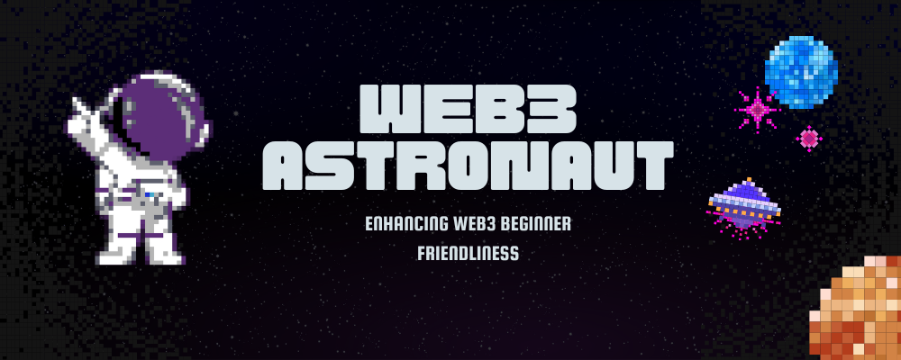

<h1>Welcome to the Web3 Astronaut 🎉</h1>

## 👨🏼‍🚀 What is Web3 Astronaut

> _"Blockchain is the tech. Bitcoin is merely the first mainstream manifestation of its potential"_.

Blockchain is an undiscovered world in and of itself, and it is difficult for newcomers to enter web3. NFTs have revolutionised the concept of art, its access, and ownership. However, it is still difficult for newcomers to get started in the vast river of opportunity that is web3.

Web3 Astronaut is an open organisation where any learner can join and delve deeply into the limitless world of web3 and blockchain. By providing tutorials, advice, roadmaps, and resources, we assist individuals all around the world in achieving what is referred to as the next internet era.

---

## Why you should join this community?

- ✅ We think that social interaction is crucial for anyone's personal development. You can interact with some wonderful people around here.
- ✅ Using Web3 and Blockchain technology, we may educate one another.
- ✅ You can demonstrate your leadership abilities since this community is still in its early stages.
- ✅ Every inquiry, in our opinion, presents a potential for learning for someone! Therefore, don't be embarrassed to ask a question.
- ✅ We have a lot of beginner-friendly open source projects here, so this is a wonderful organisation if you want to get into open source.

---

## 🤔 How to join the community?

- Submit an issue to receive an invitation to the **Web3 Astronaut** community.

> We are a new community, therefore we anticipate increased collaboration, idea sharing, and other things. We'll develop open source initiatives with an emphasis on blockchain, web3, and decentralised applications.

---

## 🛠 Teams

Additionally, we have a group of [volunteers](https://github.com/orgs/web3astronaut/teams) who support our community initiatives by producing articles, designing, and doing a lot more. Each team can operate on a separate repository. Please feel free to mention us on our [Discord server](https://discord.gg/Zec3HQszZM) if you want to join the team.

---

## 🪜 Starting Steps

1. Most new Web3 users are unsure about where to start. After studying so many things that are unrelated to blockend development, many of them simply give up. You should absolutely check out [Blockend Developer Roadmap]() if you're new to the web3 world. It leads novices down a route that is not only incredibly rewarding but also not too demanding.
2. Finding resources is the following stage in learning Web 3. The open internet is full with excellent materials, but since the web 3 is limitless, so are its learning resources. [Awesome Web3]() is a collection of more than 350 resources organised into numerous categories to best serve your needs. It was designed by us to help you find the best of the best resources in the web3 arena.
3. The most crucial step after understanding web3 is to create decentralised apps, which entails writing smart contracts. Most of us prefer to concentrate on front-end development rather writing smart contracts from scratch. Don't worry; we have designed [Smart Contracts]() to meet all of your project's smart contract requirements. It best meets your needs because it covers smart contracts at all levels, from beginner to advanced.

 

<strong>Connect with us</strong>

